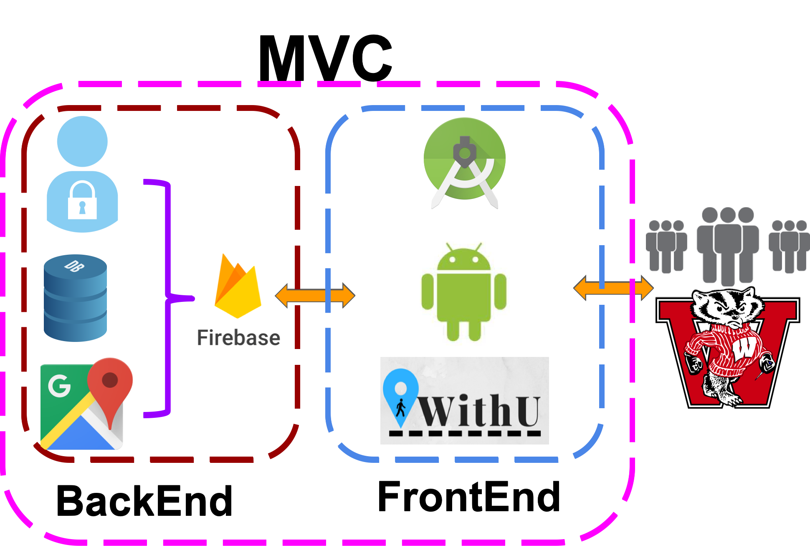

# WithU

## WithU - The application for walking home safely.

## What is this?

This is an Android App that plans to replace the Safewalk in UW-Madison. [Safewalk](https://transportation.wisc.edu/transportation/safeservices_walk.aspx) is a
service provided by UW-Madison to accompany students throughout the entire campus on night. 

## How to run the project

1. Install Android Studio
2. After successfully install Android Studio, you can clone our project by clicking **check out project from version control**, choose
**Github**, then you can download it.
3. After all the code is downloaded, you can just **run** the code in emulator.

## System Layout

